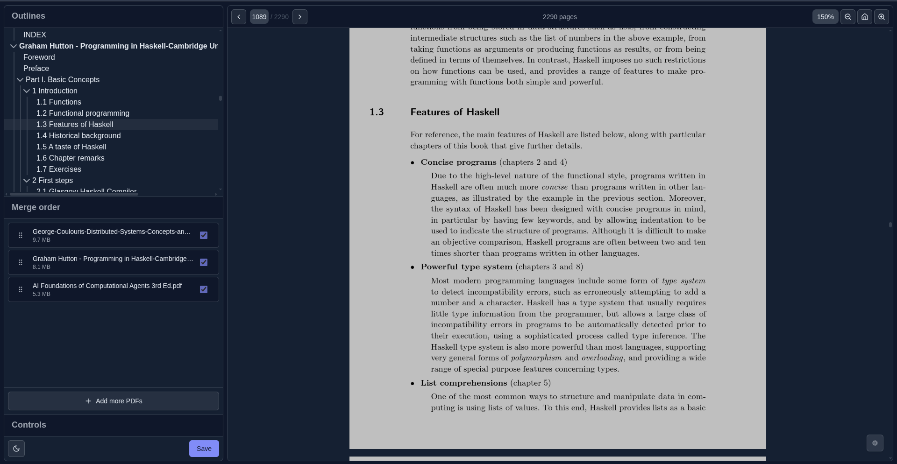

# PDF Outliner

A React application for viewing, extracting, and modifying PDF outlines (bookmarks) using PDF.js and pdf-lib.

  

## Features

- **PDF Viewing**: Responsive PDF rendering using PDF.js with zoom, and navigation controls
- **Outline Extraction**: Automatically extracts existing PDF outlines/bookmarks from uploaded files
- **Outline Visualization**: Tree-view display of PDF outline structure with page references
- **PDF Modification**: Save modified PDFs with updated outline structures

## Roadmap

### Current Features

- [x] **PDF Preview** – Interactive PDF viewer with zoom and navigation
- [x] **Outline Extraction** – Automatically reads outlines/bookmarks from uploaded PDFs
- [x] **Outline Merging** – Combine outlines from multiple PDF files
- [x] **PDF Merging** – Merge multiple PDFs into one file
- [x] **Merge Order Reordering** – Drag-and-drop interface to reorder merged files
- [x] **Add New Files in Preview** – Upload additional PDFs directly from the preview panel

### Upcoming Features

- [ ] **Edit or Remove Existing Outlines** – Modify or delete outline entries directly
- [ ] **Add New Outlines** – Create new outline entries by selecting corresponding text in the PDF viewer
- [ ] **Enhanced Outline Tree UI** – Inline renaming

## Usage

1. Load a PDF file using the **“Load PDF File”** button
2. View and navigate through the PDF using the viewer controls
3. See extracted outlines in the sidebar
4. Reorder or merge outlines and PDF files
5. (Future) Edit or add new outlines directly from the viewer
6. Export or save the modified PDF with updated outlines
